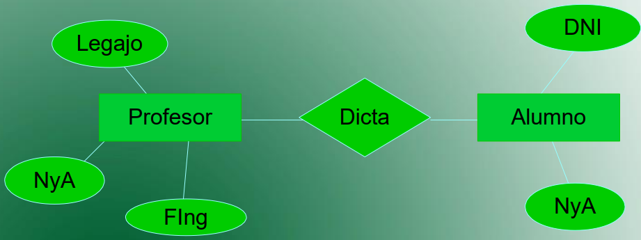
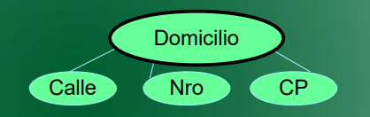
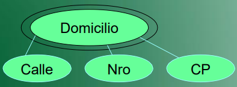
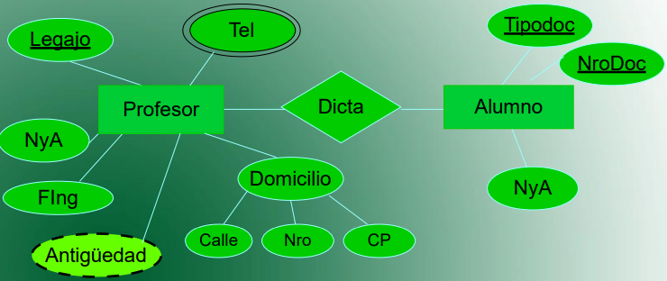
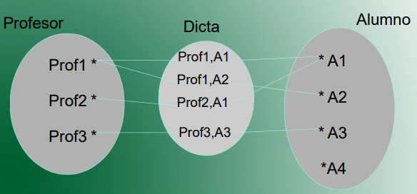

# Introducción

## Indice

- [Introducción](#introducción)
  - [Indice](#indice)
  - [Parciales](#parciales)
  - [Información Extra](#información-extra)
- [Clase 1 - Introducción DER](#clase-1---introducción-der)
  - [Definición y Elementos](#definición-y-elementos)
  - [Dominio](#dominio)
  - [Clasificación de los Atributos](#clasificación-de-los-atributos)
  - [Identificador Unico (ID)](#identificador-unico-id)
  - [Relaciones](#relaciones)
    - [Restricción de Cardinalidad](#restricción-de-cardinalidad)
    - [Restricción de Participación](#restricción-de-participación)
    - [Grado](#grado)
- [Clase 2](#clase-2)
- [Clase 3](#clase-3)
- [Clase 4](#clase-4)
- [Clase 5](#clase-5)
- [Clase 6](#clase-6)
- [Clase 7](#clase-7)
- [Clase 8](#clase-8)
- [Clase 9](#clase-9)
- [Clase 10](#clase-10)
- [Clase 11](#clase-11)

## Parciales

- 17/02 - 1° Parcial
- 05/03 - 2° Parcial
- 07/03 - Recuperatorio

## Información Extra

- **Profesores:** Agustin Gustavo y Crespo Natalia
- **Alumno:** Tiago Pujia
- **Comisión:** 1949 (verano, turno noche)
- **Fecha Inicio:** 03/02/2024
- **[Clases Grabadas](https://youtube.com/playlist?list=PLENvh_JZMnA7iPKJ3eZ-CZTfpCzVHT_yO&si=hLSYSkpMDpC3XZmM)**
- **[Apunte(este mismo)](https://github.com/Tiago-Pujia/Base-De-Datos)**

---

# Clase 1 - Introducción DER

## Definición y Elementos

DER (diagrama de entidad relacion), representa con diagramas las base de datos. Es recomendado hacer uso de la herramienta [erdplus](erdplus.com).

- **Entidad**: Cosa/objeto abstraido y distinguido por cualidades (alumno, clase, empleado, etc...), debe englobar varias cualidades. Se representa por un cuadrado. En SQL equivaldria a una tabla.
- **Atributo**: Describe caracteristicas de la entidad (persona -> nombre, apellido, edad), el nombre debe ser representativo (como las variables de un lenguaje). Se representa por una elipse.En SQL equivaldria a las columnas de una tabla.
- **Relación**: Asocia las entidades entre sí, es una forma de conectarlas. Se representa po un rombo.
- **Registro**: Cada registro representa los valores de cada entidad, teniendo en cuenta los atributos

## Dominio

El dominio (al igual que el analisis matematico) define el conjunto de valores que estan permitidos en los atributos. Por ejemplo, la edad entre 18 y 65, el legajo debe ser numerico, etc...

## Clasificación de los Atributos

- **Simple o Compuesto**: 

Los _simples_ son aquellos que no son divisibles en sub-atributos, por ejemplo la edad. Los _compuestos_ son lo divisibles como por ejemplo el domicilio -> Calle, Nro, Depto

- **Monovaluado ó Multivaluado**:

Los _monovaluado_ poseen un unico valor. Mientras que el _multivaluado_ puede contener varios valores, se represente con otra elipse superior.

- **No derivado ó Derivado/Calculable**:

Los no derivados no pueden calcularse. Mientras que el valuado se calcula apartir de otro/s atributos, por ejemplo la edad apartir de una fecha. El derivado se representa con un borde en rallas.

- **No Complejo ó Complejo**:

Los complejos son atributos compuestos y multivaluado.

- **Nulo/Opcional ó No Nulo/Obligatorio**:

Los atributos pueden o no aceptar valores (nulos), según como se diseñe el atributo. 

<!-- - **Clave ó No Clave**: -->

## Identificador Unico (ID)

El ID es un atributo que representa al registro. Si se quiere hacer un llamado del registro, se puede optar por utilizar el ID por cuestiones de eficiencia en la programación. Se representa con un subrayado al nombre del atributo.

## Relaciones

Las relaciones establecen como se asocian las entidades. Se hace uso del teorema de conjuntos. 

### Restricción de Cardinalidad

La cardinalidad se refiere ala cantidad de instancias que pueden vincularse a una relación. Esta puede ser de diferentes tipos:

- **Uno a uno (1->1)**: Cada registro en una tabla está relacionado con un solo registro en otra tabla.

- **Uno a muchos (1->N)**: Un registro en una tabla puede estar relacionado con múltiples registros en otra tabla.

- **Muchos a muchos (N->N)**: Múltiples registros en una tabla pueden estar relacionados con múltiples registros en otra tabla.

- **Muchos a uno (N->1)**: Multiples registros estan relacionados 

En el DER se debe indicar al lado de cada entidad el tipo de Cardinalidad. Ejemplo:

### Restricción de Participación

Indica si es o no obligatorio que exista la relación para una entidad

- **Total**: Debe existir una relación para una entidad si o si
- **Parcial** No es necesario que todos los registros tengan vinculación con otro

### Grado

El grado indica la cantidad de participantes de una relación. Puede ser unaria, binaria o ternaria, aunque la ternaria es raro que ocurra.

---

# Clase 2

---

# Clase 3

---

# Clase 4

---

# Clase 5

---

# Clase 6

---

# Clase 7

---

# Clase 8

---

# Clase 9

---

# Clase 10

---

# Clase 11