# Introducción

## Indice

- [Introducción](#introducción)
  - [Indice](#indice)
  - [Parciales](#parciales)
  - [Información Extra](#información-extra)
- [Clase 1 - Introducción DER y DER Extendido](#clase-1---introducción-der-y-der-extendido)
  - [Definición y Elementos](#definición-y-elementos)
  - [Dominio](#dominio)
  - [Clasificación de los Atributos](#clasificación-de-los-atributos)
  - [Identificador Unico (ID)](#identificador-unico-id)
  - [Relaciones](#relaciones)
  - [Opcionalidad](#opcionalidad)
  - [Entidades Fuertes y Debiles](#entidades-fuertes-y-debiles)
  - [Jerarquías](#jerarquías)
  - [Equivalencia de Relación Ternaria y Binarias](#equivalencia-de-relación-ternaria-y-binarias)
  - [Relaciones Transitivas](#relaciones-transitivas)
- [Clase 2 - Practica DER](#clase-2---practica-der)
- [Clase 3 - Modelo Relacional (MR)](#clase-3---modelo-relacional-mr)
  - [Etapas del Diseño](#etapas-del-diseño)
  - [Definición](#definición)
  - [Entidad](#entidad)
  - [Atributos](#atributos)
  - [Relaciones y Cardinalidad](#relaciones-y-cardinalidad)
  - [Entidades debiles](#entidades-debiles)
  - [Jerarquia](#jerarquia)
  - [Atributos en la Relacion](#atributos-en-la-relacion)
- [Clase 4 - Normalización](#clase-4---normalización)
  - [Definicion](#definicion)
  - [Dependencias Funcionales (DF)](#dependencias-funcionales-df)
  - [Dependencias Funcionales Triviales](#dependencias-funcionales-triviales)
  - [Claves](#claves)
  - [Axiomas de Armstrong](#axiomas-de-armstrong)
  - [Axiomas Adicionalas/Derivadas](#axiomas-adicionalasderivadas)
  - [Clausura de un Conjunto de Dependencias (F+)](#clausura-de-un-conjunto-de-dependencias-f)
  - [Clausura de un Conjunto de Atributos (X+)](#clausura-de-un-conjunto-de-atributos-x)
  - [Equivalencias de Conjuntos](#equivalencias-de-conjuntos)
  - [Conjunto Minimo de Dependencias Funcionales (Fmin)](#conjunto-minimo-de-dependencias-funcionales-fmin)
- [Clase 5 - Normalización 2](#clase-5---normalización-2)
  - [Conceptos](#conceptos)
  - [Formas Normales](#formas-normales)
  - [Algoritmo de Perdidas de Dependencias](#algoritmo-de-perdidas-de-dependencias)
  - [Algoritmos de Descomposición](#algoritmos-de-descomposición)
    - [Algoritmo de 3FN:](#algoritmo-de-3fn)
    - [Algoritmo de FNBC](#algoritmo-de-fnbc)
  - [Algoritmo de Perdidas de Información](#algoritmo-de-perdidas-de-información)
- [Clase 6 - Clase de Consulta](#clase-6---clase-de-consulta)
- [Clase 7](#clase-7)
- [Clase 8](#clase-8)
- [Clase 9](#clase-9)
- [Clase 10](#clase-10)
- [Clase 11](#clase-11)

## Parciales

- 17/02 - 1° Parcial
- 05/03 - 2° Parcial
- 07/03 - Recuperatorio

## Información Extra

- **Profesores:** Agustin Gustavo y Crespo Natalia
- **Alumno:** Tiago Pujia
- **Comisión:** 1949 (verano, turno noche)
- **Fecha Inicio:** 03/02/2024
- **[Clases Grabadas](https://youtube.com/playlist?list=PLENvh_JZMnA7iPKJ3eZ-CZTfpCzVHT_yO&si=hLSYSkpMDpC3XZmM)**
- **[Apunte(este mismo)](https://github.com/Tiago-Pujia/Base-De-Datos)**

---

# Clase 1 - Introducción DER y DER Extendido

## Definición y Elementos

DER (diagrama de entidad relacion), representa con diagramas las base de datos. Es recomendado hacer uso de la herramienta [erdplus](erdplus.com).

- **Entidad**: Cosa/objeto abstraido y distinguido por cualidades (alumno, clase, empleado, etc...), debe englobar varias cualidades. Se representa por un cuadrado. En SQL equivaldria a una tabla.
- **Atributo**: Describe caracteristicas de la entidad (persona → nombre, apellido, edad), el nombre debe ser representativo (como las variables de un lenguaje). Se representa por una elipse.En SQL equivaldria a las columnas de una tabla.
- **Relación**: Asocia las entidades entre sí, es una forma de conectarlas. Se representa po un rombo.
- **Registro**: Cada registro representa los valores de cada entidad, teniendo en cuenta los atributos

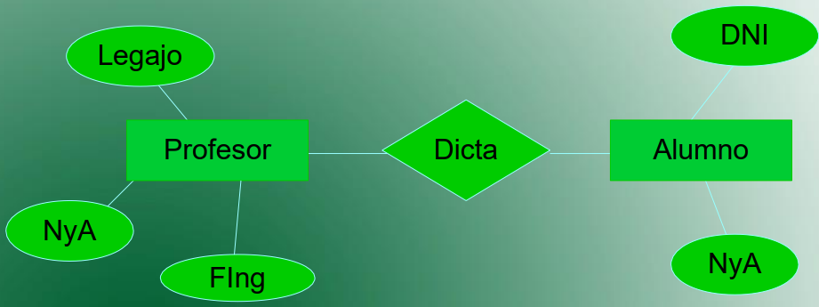

## Dominio

El dominio (al igual que el analisis matematico) define el conjunto de valores que estan permitidos en los atributos. Por ejemplo, la edad entre 18 y 65, el legajo debe ser numerico, etc...

## Clasificación de los Atributos

- **Simple o Compuesto**: 

Los _simples_ son aquellos que no son divisibles en sub-atributos, por ejemplo la edad. Los _compuestos_ son lo divisibles como por ejemplo el domicilio → Calle, Nro, Depto

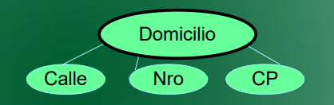

- **Monovaluado ó Multivaluado**:

Los _monovaluado_ poseen un unico valor. Mientras que el _multivaluado_ puede contener varios valores, se represente con otra elipse superior.

- **No derivado ó Derivado/Calculable**:

Los no derivados no pueden calcularse. Mientras que el valuado se calcula apartir de otro/s atributos, por ejemplo la edad apartir de una fecha. El derivado se representa con un borde en rallas.

- **No Complejo ó Complejo**:

Los complejos son atributos compuestos y multivaluado.

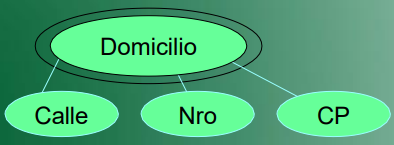

- **Nulo/Opcional ó No Nulo/Obligatorio**:

Los atributos pueden o no aceptar valores (nulos), según como se diseñe el atributo. 

<!-- - **Clave ó No Clave**: -->

## Identificador Unico (ID)

El ID es un atributo que representa al registro. Si se quiere hacer un llamado del registro, se puede optar por utilizar el ID por cuestiones de eficiencia en la programación. Se representa con un subrayado al nombre del atributo. 

Presenta caracteristicas como unico, no nulo, inmutable (no cambiar), puede ser alfanumerico o numerico, en la mayoria de casos es autoincremental si es numerico (ej: en cada registro nuevo automaticamente incrementa 1, 2, 3...)

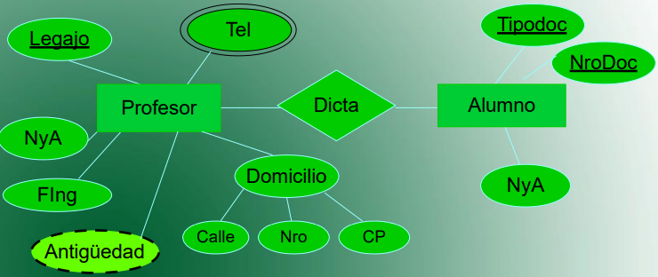

## Relaciones

Las relaciones establecen como se asocian las entidades. Se hace uso del teorema de conjuntos. 

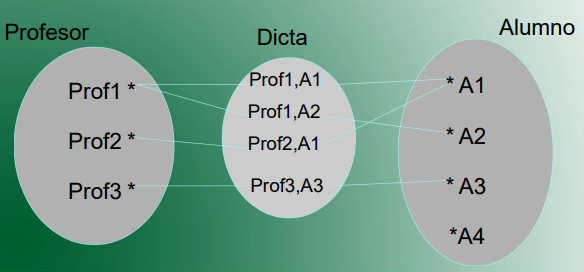

> **Restricción de Cardinalidad**
> 
> La cardinalidad se refiere ala cantidad de instancias que pueden vincularse a una relación. Esta puede ser de diferentes tipos:
> 
> - **Uno a uno (1→1)**: Un registro de la primera tabla le corresponde como máximo un registro en la segunda tabla, y viceversa.
> 
> - **Uno a muchos (1→N)**: Un registro de la primera tabla le pueden corresponder muchos registros en la segunda tabla, pero cada registro de la segunda tabla solo tiene un registro asociado en la primera tabla.
> 
> - **Muchos a uno (N→1)**: Muchos registros de la primera tabla pueden estar asociados a un solo registro de la segunda tabla.
>
> - **Muchos a muchos (N→N)**: Muchos registros de la primera tabla pueden estar relacionados con muchos registros de la segunda tabla, y viceversa.
> 
> En el DER se debe indicar al lado de cada entidad el tipo de Cardinalidad. Ejemplo:
> 
> 

> **Restricción de Participación**
> 
> Indica si es necesario que cada registro este relacionado si o si con otra entidad, o no.
> 
> - **Total**: Todos los elementos de la entidad deben participar en la relación
> - **Parcial** No todos los elementos de la entidad deben participar
> 
> Por ejemplo: En la primera imagen se ve que la entidad "profesor" tiene asignado todos los registros, por lo que es parcial. A lo contrario de la entidad "Alumno" en cual hay registros (A4) sin vinculo, por lo que es parcial.

> **Grado**
> 
> El grado indica la cantidad de participantes de una relación. Puede ser unaria, binaria o ternaria, aunque la ternaria es raro que ocurra.

## Opcionalidad

Restricción de participación es parte de la opcionalidad sobre la relación de los registros. Para indicar si es obligatorio en una entidad se utiliza doble linea en el conector, para la opcionalidad se utiliza una circunferencia.

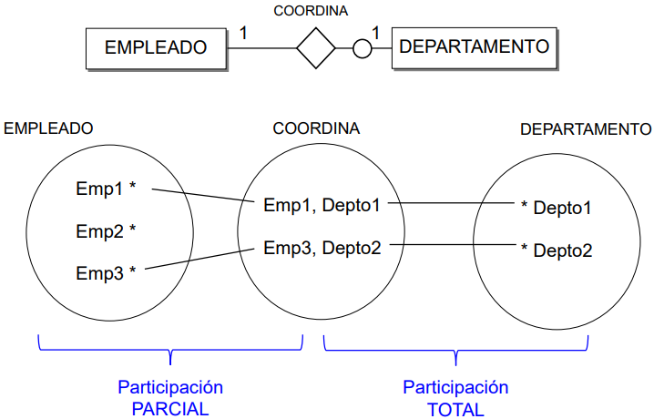

De todas maneras, no es comun indicar la opcionalidad en el DER. Debido a que no influye en el Modelo Relacional/Diseño.

## Entidades Fuertes y Debiles

Las _entidades debiles_ son aquellas que no poseen un ID propio. Por lo tanto, necesitan hacer uso de otras entidades (_fuertes_) para diferenciar los registros y realizar llamados a los mismos.

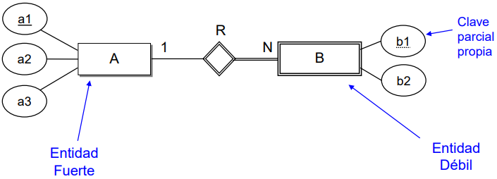

Su participación es total y no puede ser tipo N. Las debiles se identifican con un doble borde. 

## Jerarquías

Hay dos tipos de jerarquias:

> **Jerarquía de Generalización**
> 
> <!-- 
> Nace abajo y la generalizo; se tiene entidades distintas con cosas en comun y se genera una entidad madre que agrupa los atributos comunes
> -->
> 
> Comienza desde abajo agrupando las entidades con caracteristicas en comun, para ser englobado por una entidad madre; similar a obtener el factor comun. Se utiliza la forma geometrica hexágono con lados extendidos para indicar la Jerarquía.
> 
> Las entidades "hijos" heredan los atributos de la entidad "madre". Un registro pertenece siempre al madre y debe participar en una entidad hijo (_partición total_) y solo en uno (_sin solapamiento_).
> 
> 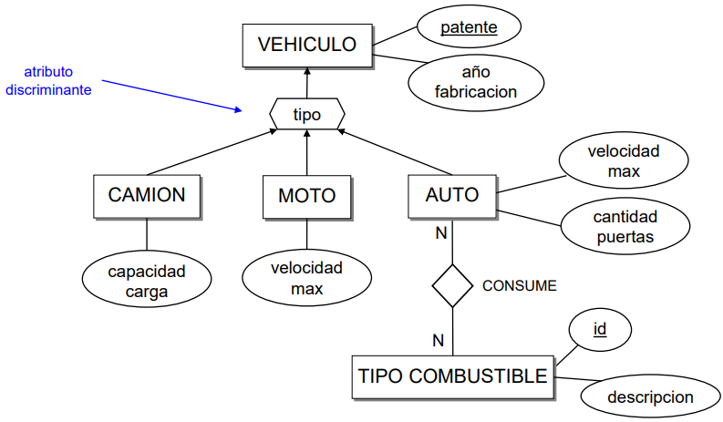
> 
> En este caso, todo vehiculo tendra si o si los atributos "patente" y "año fabricacion". Pertenecera a alguna de las entidades "Camion", "moto" o "auto", pero nunca dos o más a la vez.

> **Jerarquía de Subconjuntos**
> 
> Comparte similitudes con el generalizado, se lee de abajo hacia arriba y sigue agrupando entidades. Pero ya no tiene la forma geometrica como union, se utilizan flechas directamente.
> 
> Las entidades hijos siguen herando los atributos de la madre. Pero ahora, un registro puede pertener a ninguno (_partición parcial_), uno o todos a la vez (_solapamiento_).
> 
> 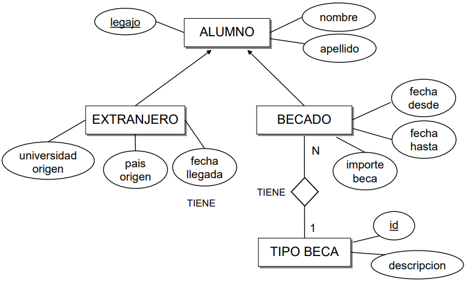
> 
> En este caso, un alumno puede ser extranjero o becado, puede ser ninguna de las dos o ambas a la vez.

## Equivalencia de Relación Ternaria y Binarias

## Relaciones Transitivas

Hay que tener cuidado con las relaciones que se crean, la creación de cada una es equivalente a que se le haga mayor mantenimiento a la base de datos, por lo que se debe crear lo minimo indispensable. Por ejemplo:

> 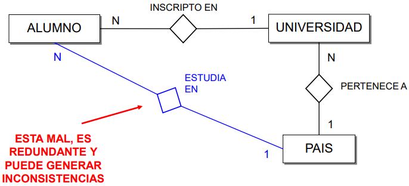
> 
> En esta imagen se quiere consulta en que pais estudia el alumno. La solución erronea seria crear una relación entre ambas entidades, cuando se puede resolver haciendo un llamado a alumno → universidad → pais; realizar un llamado entre entidades

> 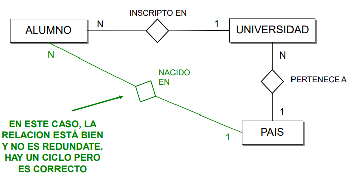
> 
> En este caso, se quiere consultar en que pais nacio el alumno. Saber en el pais que pertenece la universidad, no es condición necesaria para que alumno sea del mismo (puede ser extranjero). Por lo que es valido crear una relación.

---

# Clase 2 - Practica DER

---

# Clase 3 - Modelo Relacional (MR)

## Etapas del Diseño

1. Analisis de Requerimientos
2. Modelo Conceptual (DER)
3. Modelo Logica (MR)
4. Modelo Fisico (Script)

## Definición

Permite representar del DER con un modelo Logica por medio de un Modelo Relacional. El mismo, se basa principalmente en el uso de tablas y sus relaciones. Se tienen los siguientes conceptos:
- Tabla = Entidades = Relacion
- Filas = Registros = Tuplas = Datos
- Columans = Atributos
- Grados = Cant Columnas

## Entidad

> - **Entidades o Tablas**
> 
> Se escriben con el formato: \[**NOMBRE TABLA**]( \[**ATRIBUTOS**] ). Ejemplo:
> 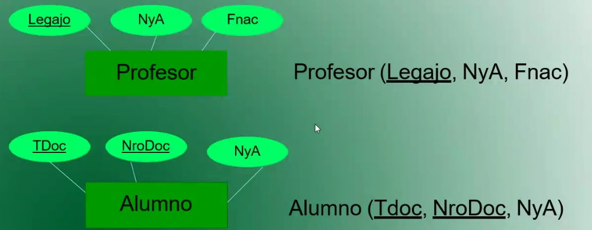
> 

## Atributos

> - **Atributos Clave** 
>
> Una _llave foranea_, es un atributo clave primaria que le pertenece a otra tabla que se encuentra relacionada con la misma. La _llave primaria_ es un ID o clave propia de la tabla.
> 
> - Llave Primaria (PK), Unico o Clave = Subrayado
> - Llave Foranea (FK) o clave externa = Subrayado en rayas
> - FK y PK = subrayado de doble linea

> - **Multivaluados**
>  
> Se utiliza una tabla aparte con los valores posibles. Ejemplo:
> 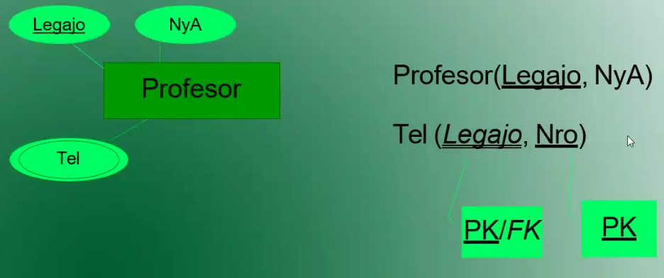

> - **Compuestos** 
>  
> Se añaden como atributos comunes de la tabla principal
> 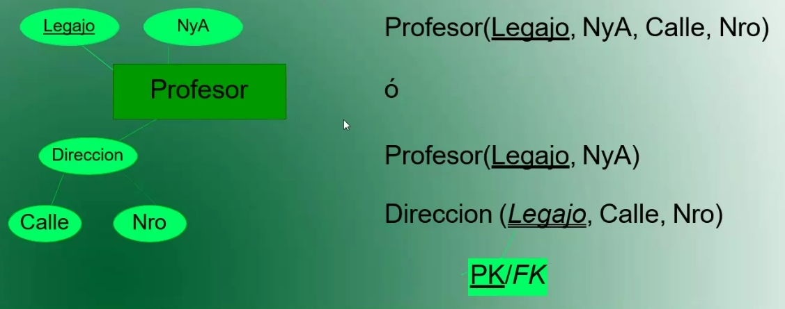

> - **Derivado**
>
> El derivado no se pasa ni como atributo ni como tabla 

## Relaciones y Cardinalidad

Vamos a ver que ocurre con las relaciones con su respectiva cardinalidad

> - **Binarias**
> 
> - N→N: Siempre se crea una nueva tabla
> 
> - N→1 o 1→N: Se crea un nuevo atributo en la tabla con cardilanidad N, con las claves foraneas de la otra tabla de cardilanidad 1.
> 
> - 1→1: Elegis en cualquiera de las dos tablas y agregas los atributos con las llaves foraneas de la otra pero con el agregado que son de tipo unica

> - **Unarias**
> 
> - N→N: Siempre se crea una nueva tabla
>
> - 1→N, N→1 ó 1→1: Los resultados son iguales y su existencia no tiene mucho sentido. Simplemente se agrega un atributo a la tabla relacionada que haga referencia a la relacion unaria. 

> - **Ternaria**
> 
> La ternaria siempre genera otra tabla compuesta con llaves foraneas de las tablas relacionadas 
>
> - N→N→N: Las tres entidades tienen una participación múltiple (N) en la relación. Para esto, todas las claves seran PK.
> 
> - N→N→1: Significa que una de las entidades tiene una participación única (1), y las otras dos tienen una participación múltiple (N). Solo las N seran PK, la de 1 seran solo FK. 
> 
> - N→1→1: Las de participación N seran PK y se elige tambien como PK una de las dos claves 1. La otra que no fue elegida sera solo FK.
>
> - 1→1→1: Cada instancia de la relación ternaria está asociada exactamente con una instancia de cada una de las tres entidades. Se eligen 2 cualquiera para sean PK, la restante solo sera FK.

## Entidades debiles

La debil se expresa igual que el atributo multivaluado; Se crea una tabla para la entidad debil, se crea un nuevo atributo para la clave primaria de la fuerte (llave foranea) y se añaden los atributos pertenecientes a la entidad debil.

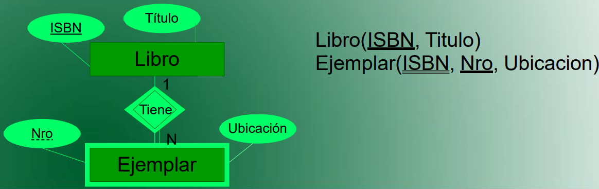

## Jerarquia

Hay 2 maneras de unir las jerarquias:
> Una de ellas es que crear una tabla diferente para cada entidad hijo y padre, con sus respectivos atributos heredados y dados. Este metodo funciona para cualquier tipo de jerarquia, pero es muy ineficiente.
>
> Este metodo tiene la ventaja de puede ocupar menos espacio que el otro, pero requiere un mantenimiento y complejidad mucho mayor.

> La otra manera, consta  de crear en una unica tabla toda la jerarquia en sí. Es el metodo ideal, pero solo funciona en casos especificos.
>
> Puede ocuparte un poco mas de espacio, pero a dia de hoy no es mucho problema, aparte que te realiza un labor mas facil. Razon por la que es recomendado por el profesor.

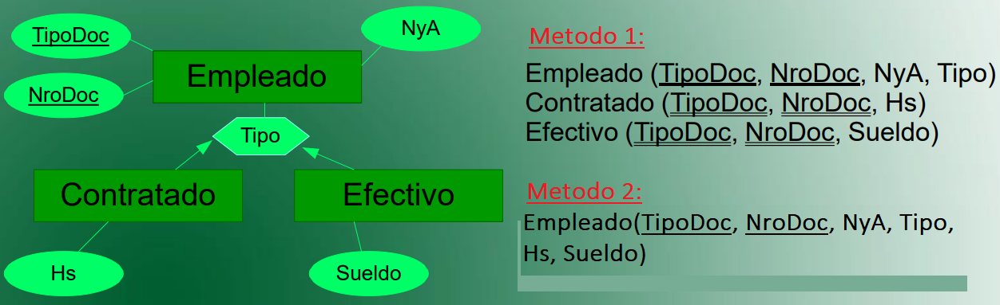

## Atributos en la Relacion

En este capitulo habla sobre como se comportan las relaciones que tienen atributos. Ejemplo (aula):

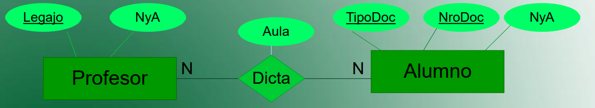

- **N→N**: Se crea un nuevo atributo en la tabla ya creada.
- **1→N ó N→1**: Se agregará el atributo en la relación con cardinalidad N.
- **1→1**: Se transpasan todos atributo nuevo y claves foraneas a cualquiera de las 2 tablas. Si hay alguna con opcionalidad, entonces se elige la que no la tiene.

---

# Clase 4 - Normalización

## Definicion

La Normalización es un proceso mediante el cual se puede depurar un diseño de base de datos. Permite eliminar ciertos defectos y características indeseables de los esquemas. Algunos de los problemas que resuelve:
- Redundancia o repetición de datos
- Anomalias de inserción, actualización o eliminación
- Perdida información

Algunos beneficios que puede traer:
- Menos espacio de almacenamiento 
- Actualizaciones más rápidas 
- Menor inconsistencia de datos 
- Relaciones más claras
- Procedimientos más sencillos para la inserción de
- datos
- Estructura de datos flexible

## Dependencias Funcionales (DF)

Los atributos se van a representan con variables, como "x", "y", "z" o "w". Las dependencias funcionales son una relación entre atributos de una tabla. La dependencia se representan con flechas, como X→Y, se lee "X determina Y" o "Y es dependiente de X".

Ejemplo:

EXAMEN(DNI, NOMBRE, APELLIDO, COD_MATERIA, NOMBRE_MATERIA, FECHA,NOTA)

Las dependencias de la tabla:

- DNI → NOMBRE, APELLIDO
- COD_MATERIA → NOMBRE_MATERIA
- DNI, COD_MATERIA, FECHA → NOTA

## Dependencias Funcionales Triviales 

Decimos que una dependencia funcional es Trivial cuando es obvia. Por ejemplo X→X. Todo conjunto de atributos se determina a si mismo o a un conjunto de atributos menor (que este contenido en el primero). XY → X

## Claves

> Se tendra el siguiente esquema: 
>  
> EMPLEADO(**LEGAJO**, NOMBRE, DNI)
>   
> _Dependencias:_
> - LEGAJO → NOMBRE, DNI
> - DNI → NOMBRE, LEGAJO

- **SuperClaves**

Las **SuperClaves** son aquellos conjuntos atributos que nos sirven para obtener todos los otros atributos de la tabla. Ejemplo:

Superclaves = {Legajo, Nombre ; DNI, Nombre ; Legajo, DNI ; Legajo, Nombre, DNI ; Legajo ; DNI }

- **Claves Candidatas (CC)**

Una clave candidata es como una superclave, con la diferencia que un conjunto es reducido al minimo, eliminando aquellos atributos que no son necesarios para representar toda la fila. Ejemplo:

Claves Candidatas = {Legajo, DNI}

## Axiomas de Armstrong

- Reflexividad

Si Y _C_ X => X→Y

- Aumento

X→Y Se puede inferir XZ → YZ

- Transitivdad

X→Y y Y→Z => X→Z

## Axiomas Adicionalas/Derivadas

- Descomposición

X→YZ => X→Y y X→Z

- Union

X→Y y X→Z => X→YZ

- Pseudotransitivdad

X→Y y WY→Z => WX→Z

## Clausura de un Conjunto de Dependencias (F+)

Todas las dependencias triviales + Axiomos Armstrong + Dependencias Inferiras

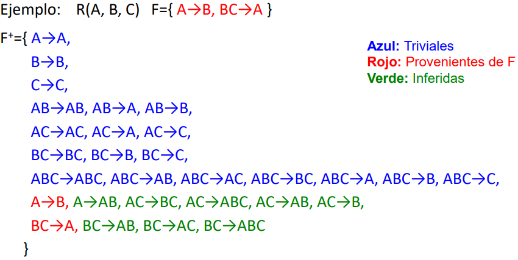

No se pide esto en ejercicios de todas maneras. Pero, esta clausura nos sirve para encontrar la superclaves de un conjunto de dependencias. En este caso superclaves = {AC, BC, ABC}

## Clausura de un Conjunto de Atributos (X+)

Indica todos los atributos que se pueden encontrar apartir de un conjunto de dependencias.

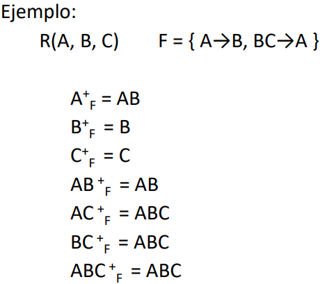

Esta clausura nos sirve para encontrar la CC de un conjunto de dependencias. En este caso CC = {AC, BC, ABC}

## Equivalencias de Conjuntos

Se nos presentan dos conjuntos de dependencias funcionales. Dos conjuntos son equivalentes si sus clausuras son idénticas, es decir, si generan el mismo conjunto de dependencias inferidas.

Para demostrar que dos conjuntos son equivalentes, sin necesidad de calcular explícitamente sus clausuras, es suficiente con probar que:

- F⊆G+: Toda dependencia funcional en 𝐹 puede inferirse a partir de 𝐺 
- G⊆F+: Toda dependencia funcional en G puede inferirse a partir de F 

Para ello, debemos identificar el lado izquierdo de cada dependencia en uno de los conjuntos y verificar que su clausura dentro del otro conjunto contenga los mismos atributos dependientes.

Ejemplo:

> R (A, B, C, D)
> 
> F = { A→B, A→C, B→A, D→A }
>  
> G = { D→ABC, B→A, B→C, A→B }

> **Elemento 1 (F: A→B)**
>
> Ya hay un elemento identico en G 
>
> A+= ABC

> **Elemento 2 (F: A→C)**
>
> Apartir del elemento 3 y 4 se puede encontrar la dependencia:
>
> A+= ABC
>   
> A→B y B→C = A→C 
>
> A→B→C  
>
> A→C

> **Elemento 3 (F: B→A)**
>
> Ya hay un elemento identico en G
>
> B+= ABC

> **Elemento 4 (F: D→A)**
>
> Para esto, utilizamos el primer elemento
>
> D→**A**BC 
>
> D+= ABCD

## Conjunto Minimo de Dependencias Funcionales (Fmin)

Inverso de F+, se debe bajar al minimo las dependencias funcionales. Un conjunto de dependencias funcionales es Mínimo si cumple las siguientes tres condiciones:
- Todas sus dependencias funcionales tienen un solo atributo en su parte derecha (determinado).
- No podemos reemplazar ninguna dependencia funcional X→A por otra Y→A, donde Y C X, y seguir teniendo un conjunto equivalente.
- No podemos quitarle ninguna dependencia funcional y seguir teniendo un conjunto equivalente. 

Para transformar un conjunto a Fmin, se tienen 3 pasos:

> **1. Minimización de Atributos en el Lado Derecho**
>
> Debe haber un solo atributo del lado derecho de la dependencia. Para esto, se descomponen en independencias individuales
>
> A→BC => A→B y A→C

> **2.  Minimización de Atributos en el Lado Derecho** 
> 
> Para cada independencias de 2 o mas atributos claves. Obtener la clausura de atributos de cada uno. Se verifica que se puede llegar a la parte derecha, sin necesidad del otro atributo clave. Si es así se elimine el sobrante
>
> { AB→C, A→C } => { A→C }

> **3. Eliminar Dependencias Redundantes**
>
> Una dependencia funcional es redundante si se puede derivar a partir de las otras dependencias en el conjunto.
>
> {A→B, B→C, A→C} => A→C es redundante porque se obtiene como A→B→C => {A→B, B→C}

Ejemplo:

> R(ABCDE) F={A→BCD, AB→DE, BE→AC}

> **1. Minimización de Atributos en el Lado Derecho**
>
> F1 = { {A→B, A→C, A→D}, {AB→D, AB→E}, {BE→A, BE→C} }

> **2.  Minimización de Atributos en el Lado Derecho** 
>
> 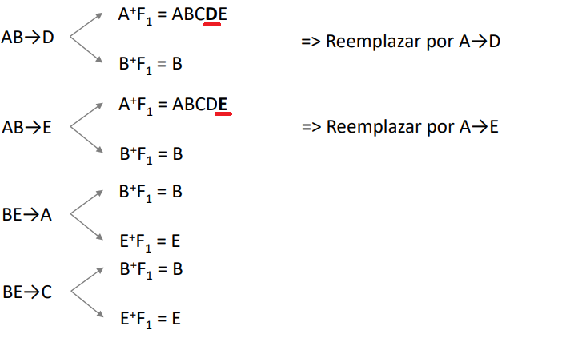
>  
> F2 = {A→B, A→C, A→D, A→E, BE→A, BE→C }

> **3. Eliminar Dependencias Redundantes**
> 
> El unico que se elimina es A→C. Debido a que ya se puede obtener como A→B + A→E = BE→C
>  
> F3 = { A→B, A→D, A→E, BE→A, BE→C }

---

# Clase 5 - Normalización 2

## Conceptos

- **Atributo Atomico**: Pueden tener un solo valor en una fila. Como al igual no debe tener atributos repetidos, osea que cumplen con la misma función pero tienen diferente nombre.
- **Dependencia Parcial**: Ocurre cuando un atributo depende de solo una parte de la clave primaria compuesta.
- **Dependencia Transitiva**: Un atributo depende de otro que depende de otro. Ejemplo: A→B; B→C => A→C
- **Atributo Primo**: Cualquier atributo que forma parte de una clave candidata.

## Formas Normales

El proceso de la normalización se basa en la descomposición del esquema, utilizando las dependencias funcionales. Existen diferentes niveles de normalización donde en cada nivel superior, la información esta más normalizada pero tiene mas requisitos.

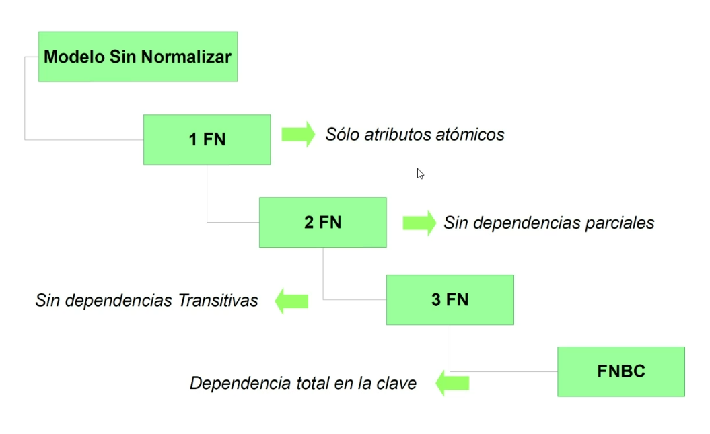

Cada dependencia puede ser de una forma diferente, y la dependencia mas baja determina la forma de la tabla- Para identificar la forma de cada dependencia, se debe seguir el siguiente esquema luego de sacar el Fmin:

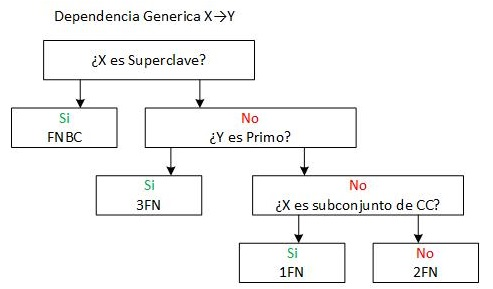

> **Ejemplo:**
> - _Tabla y Dependencias:_ 
>  
> R(ABCDEFG) con Fmin = { B → CD, C → AF, F → B, FC → D, ACB → ED, BD → A }
>
> - _Obtenemos Claves Candidatas:_
>
> ~~~
> A += A
> B += ABCDEF
> C += ABCDEF
> D += D
> E += E
> F += ABCDEF
> G += G
> ~~~
> 
> CC = { BG, CG, FG } 
> 
> - _Determinar Formas de las Dependencias:_
>
> Para esto, utilizamos el esquema anteriormente mostrado 
>
> | Dependencia | Forma |
> |-------------|-------|
> | B → CD      | 1FN   |
> | C → AF      | 1FN   |
> | F → B       | 3FN   |
> | FC → D      | 2FN   |
> | ACB → ED    | 2FN   |
> | BD → A      | 2FN   |
>
> La dependencia con su forma minima es 1FN. Por lo que, la tabla tiene forma 1FN.

## Algoritmo de Perdidas de Dependencias

El problema de la descompoción es que se puede tener perdidas de dependencias funcionales e información. Por lo que por seguridad, se debe verificar las estructuras y registros.

Se dice que una descomposición conserva todas sus dependencias funcionales si: 
~~~
Fd={ F1 U F2 U F3... U Fi}+ = F+
~~~
La union de las dependencias funcionales de todas las tablas descompuesto es equivalente a la F original.

> **Ejemplo:**
>
>  - _Tabla Original:_
>  
>  R(A,B,C) con F = { A→B, B→C, C→B, A→C }
>
> - _Tabla Descompuesta:_
>   - R1(A,C) F1 = {A→C}
>   - R2(B,C) F2 = {B→C, C→B}
>  
> - _Comprobar Descomposición:_
>
> (F1 U F2) = {A→C, B→C, C→B} 
>
> Para la dependencia A→B, se puede derivar por medio de las dependencias de F1 y F2. La propiedad transitiva funciona entre tablas.
>
> - _Resultado:_
> 
> Por lo que, no hubo perdida de DF

## Algoritmos de Descomposición

Existen 2 algoritmos con caracteristicas propias:

- **Algoritmo de 3FN:**
  - No existe pérdida de dependencias funcionales
  - No existe pérdida de información
- **Algoritmo de FNBC:**
  - Puede o no existir pérdida de dependencias funcionales
  - No existe pérdida de información
  - Mucho mas complicado

### Algoritmo de 3FN:

1. **Calcular Fmin**
2. **Descomponer** la relación en nuevas tablas, separando las dependencias que comparten la misma parte izquierda.
3. **Verificar** si la clave candidata global de Fmin está presente en alguna tabla. Si no es así, se debe crear una nueva relación que la contenga.
4. **Eliminar** relaciones redundantes
5. **Verificar** que las relaciones cumplen con la Tercera Forma Normal (3FN).

> - **Ejemplo:**
> 
> _Conjunto de Dependencias:_
> 
> R(ABCDEFG) con F = { B → CD, C → AF, F → B, FC → D, ACB → ED, BD → A }
>
> 1. _Creamos Fmin:_
> 
> Fmin = {B → C, C → F, F → B, C → D, B → E, B → A}
>
> 2. _Separamos en conjuntos:_
>
> | Atributos | Conjunto Dependencias | Conjunto Resumido | CC          |
> |-----------|-----------------------|-------------------|-------------|
> | R1(ABCE)  | F = { B→C ,B→E ,B→A } | { B → ABCE }      | CC1 = { B } | 
> | R2(CDF)   | F = { C→F, C→D }      | { C → CDF }       | CC2 = { C } | 
> | R3(FB)    | F = { F→B }           | { F → B }         | CC3 = { F } |
>
> 3. _Verificar CC Global:_
>
> Analizamos las claves candidatas para el conjunto en union:
> ~~~
> A += A
> B += ABCDEF
> C += ABCDEF
> D += D
> E += E
> F += ABCDEF
> G += G
> ~~~
>
> CC = { CG, BG, FG }
>
> Ninguna tabla tiene una clave candidata global. Por lo que, debemos crear una nueva con esta misma. Quedandonos como:
> | Atributos | Conjunto Dependencias | Claves Candidatas |
> |-----------|-----------------------|-------------------|
> | R1(ABCE)  | F1 = { B→ACE }         | { B }             | 
> | R2(CDF)   | F2 = { C→DF }          | { C }             | 
> | R3(FB)    | F3 = { F→B }           | { F }             |
> | R4(BG)    | F4 = {}                | { BG }            |
>
> 4. _Eliminar Redundancias:_
>  
>  No hay redundancias
>  
> 5. _Verificamos Formas:_
>
> Verificamos las formas de las dependencias con sus respectivas claves
> 
> | Dependencia | CC | Forma |
> |-------------|----|-------|
> | B → A       | B  | FNBC  |
> | B → C       | B  | FNBC  |
> | B → E       | B  | FNBC  |
> | C → D       | C  | FNBC  |
> | C → F       | C  | FNBC  |
> | F → B       | F  | FNBC  |

### Algoritmo de FNBC

## Algoritmo de Perdidas de Información

En toda descomposición, cada registro debería poder reconstruirse. Si no pudiera reconstruirse se dice que esa descomposición es inválida. Se pueden perder registros o crear registros de más. Existe el algoritmo de Tableau para verificar la perdida de información con N cantidad de relaciones

1. Se crea una matriz en la que cada fila representa una tabla descompuesta y cada columna corresponde a un atributo.
2. Se rellenan las celdas de la matriz de la siguiente manera:
    - Para los atributos presentes en la relación, se asigna la letra "a" seguida del número de la columna.
    - Para los atributos ausentes en la relación, se coloca una "b" seguida del número de fila y columna.
3. Se inicia un bucle iterando sobre el conjunto de dependencias funcionales hasta que no se puedan realizar más cambios o se obtenga una fila compuesta únicamente por valores "a" al finalizar el bucle. Para aplicar el algoritmo, se sigue el siguiente procedimiento:
   1. Se seleccionan las columnas correspondientes a los atributos del lado izquierdo de la dependencia funcional (X), y se verifica si almenos dos filas tienen valores iguales en esas columnas (ya sean "a" o "b" con su respectivo numero de fila y columna). Si no son iguales, se pasa a la siguiente dependencia.
   2. Si las filas son iguales en X, se evalúa la columna del atributo dependiente (Y):
        - Si al menos una de las filas coincidentes tiene la letra "a", se reemplazan los valores de las demás filas coincidentes con "a".
        - Si ninguna fila tiene "a", se igualan los valores de fila y columna asociados a la letra "b" en las filas afectadas.

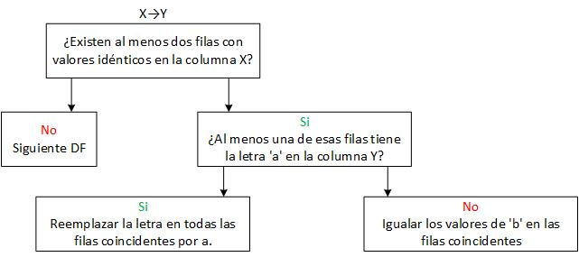

**Notas:**
- Una b nunca puede pisar la letra a. Como a su vez, la letra solo puede ser pisada por la a y solo modificada por la b
- Como se puede aprecia en el algoritmo. Si una columna esta compuesta solo por la letra b, automaticamente hay perdida de informacion

> - **Ejemplo**
>
> R(ABCDEFG) con F = { BC → E, CE → F, BFE → D, DG → F, EF → C, A → D, ADF → G }
>
> 1. ***Crear matriz***
> 
> |    | A  | B  | C  | D  | E  | 
> |----|----|----|----|----|----| 
> | R1 |    |    |    |    |    | 
> | R2 |    |    |    |    |    | 
> | R3 |    |    |    |    |    | 
>
> 2. ***Rellenar Matriz***
> 
> |    | A  | B  | C  | D  | E  | 
> |----|----|----|----|----|----| 
> | R1 | a1 | a2 | a3 | b14| b15| 
> | R2 | b21| b22| a3 | a4 | b25| 
> | R3 | a1 | b32| b33| a4 | a5 | 
>
> 3. ***Recorrido de las Dependencias***
> 

---

# Clase 6 - Clase de Consulta

---

# Clase 7

---

# Clase 8

---

# Clase 9

---

# Clase 10

---

# Clase 11